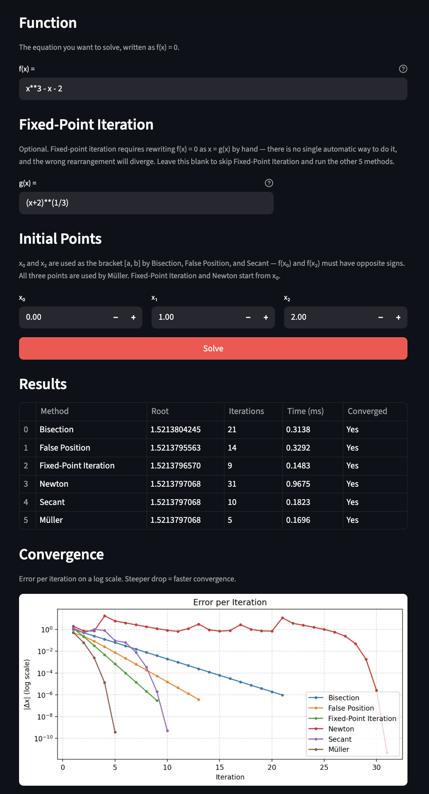

# RootLab

Streamlit dashboard comparing 6 numerical root-finding methods: Bisection, False Position, Fixed-Point Iteration, Newton, Secant, and Müller.

Back in college I did a project on Muller's method and it stuck with me. Recently came across how Newton's method logic shows up in modern CPU/GPU hardware design and optimization, which sparked the urge to revisit some numerical analysis. This is a small project to refresh that knowledge and see the methods side by side.

## What it does

Enter any function `f(x)` and a set of initial points, then hit Solve. The dashboard runs all six methods against your input and shows:

- A results table with the root found, iteration count, runtime, and whether the method converged
- A convergence plot showing error per iteration on a log scale, so you can directly compare how fast each method closes in on the root

Fixed-Point Iteration requires you to supply a `g(x)` manually (rewriting `f(x) = 0` as `x = g(x)`); the other five methods run automatically.



## Running

```
pip install -r requirements.txt
streamlit run app.py
```
